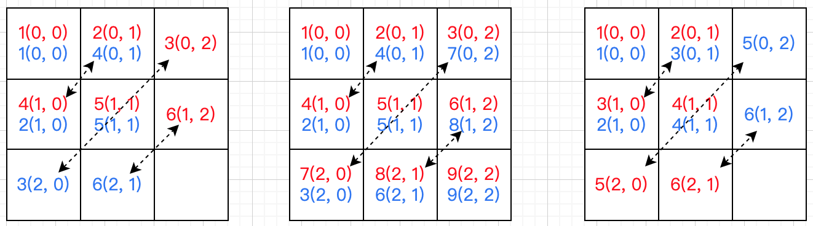

image.png

# LeetCode 867. 转置矩阵

## 解题思路 - 模拟法
转置矩阵本质是沿对角线翻转，图解如下：



**模拟法：**

1. 新建矩阵：如果矩阵 *matrix* 为 *m* 行 *n* 列，则转置后的矩阵 *matrix*<sup>T</sup> 为 *n* 行 *m* 列
2. 遍历矩阵：*matrix*<sup>T</sup>\[*j*][*i*]=*matrix*\[*i*][*j*]

## 代码实现
```go
func transpose(matrix [][]int) [][]int {
	// 1. 获取二维数组的行和列
	rows := len(matrix)
	if rows == 0 {
		return [][]int{}
	}
	cols := len(matrix[0])

	// 2. 新建二维数组
	ans := make([][]int, cols)
	for i := range ans {
		ans[i] = make([]int, rows)
	}

	// 3. 遍历二维数组
	for i, row := range matrix {
		for j, val := range row {
			ans[j][i] = val
		}
	}

	return ans
}
```

## 复杂度分析
- 时间复杂度：O(m × n)，其中 m 和 n 分别是矩阵的行数和列数。我们需要遍历整个矩阵一次。
- 空间复杂度：O(1)。除了返回值以外，额外使用的空间为常数。
